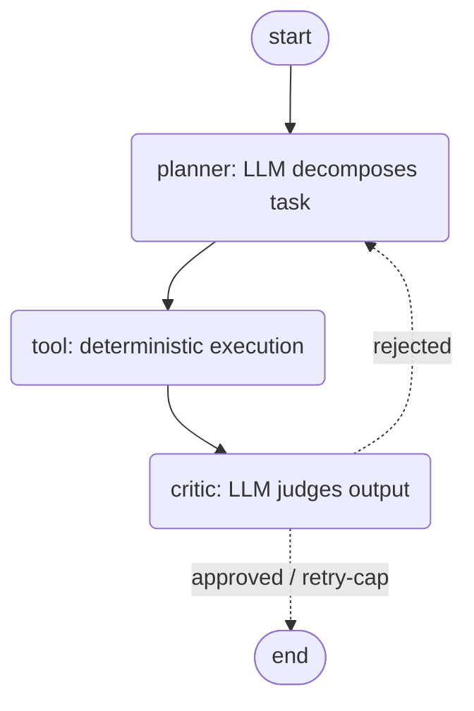
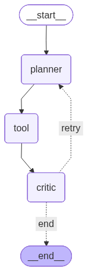

# LangGraph Multi-Agent Orchestrator

[](https://github.com/VMG-Emjan/langgraph-orchestrator/actions/workflows/ci.yml)

A **formal, framework-based multi-agent orchestration** system built with
**LangGraph**. It implements a classic **planner → tool → critic** loop as a
compiled **`StateGraph`** with **conditional routing** (`add_conditional_edges`)
and a **`MemorySaver`** checkpointer for state persistence. The planner and
critic are real LLM agents (DeepSeek, OpenAI-compatible); the tool step is
deterministic so runs are reproducible and CI needs no API key.

This repo is a minimal, runnable reference for **LangGraph multi-agent
orchestration** — the kind of formal orchestration framework (vs. ad-hoc glue)
that production agent systems are built on.

## Architecture





### planner → tool → critic pattern

| Node | Role | Backed by |
|------|------|-----------|
| **planner** | Decomposes the task into 2–4 ordered sub-tasks | DeepSeek LLM |
| **tool** | Executes each sub-task, collects outputs | Deterministic function (swap for a real API/search) |
| **critic** | Judges whether the outputs satisfy the task | DeepSeek LLM |

The **critic** drives a **conditional edge**: on approval (or when the retry cap
is hit) the graph routes to `END`; otherwise it loops **back to the planner**
with the critique, so the plan improves on the next pass. State flows through a
single typed `OrchestratorState` (`TypedDict`) and is persisted per-thread by
the `MemorySaver` checkpointer.

## Layout

```
src/state.py        OrchestratorState TypedDict (task, plan, results, retries…)
src/nodes.py        planner_node, tool_node, critic_node, route_after_critic
src/graph.py        StateGraph wiring + conditional edges + checkpointer
examples/run_example.py    end-to-end run against real DeepSeek
examples/render_graph.py   renders assets/graph.png (Mermaid)
tests/              pytest suite (LLM mocked → CI needs no key)
```

## Run it

```bash
python -m venv .venv && source .venv/bin/activate   # Windows: .venv\Scripts\activate
pip install -r requirements.txt

export DEEPSEEK_API_KEY=sk-...        # Windows PS: $env:DEEPSEEK_API_KEY="sk-..."
python examples/run_example.py
```

### Tests (no API key required)

```bash
pytest -q
```

The DeepSeek LLM is monkeypatched in tests, so the suite is deterministic and
green in CI without any secret.

## Example run

<!-- EXAMPLE_OUTPUT -->
Real end-to-end run against the DeepSeek API (`python examples/run_example.py`):

```
======================================================================
TASK: Research the benefits of LangGraph for multi-agent orchestration and outline a short blog post.
======================================================================
PLAN: ['Identify key benefits of LangGraph for multi-agent orchestration',
       'Gather supporting examples and use cases',
       'Structure the blog post outline with introduction, body, and conclusion',
       'Draft a concise outline covering main points']
----------------------------------------------------------------------
EXECUTION TRACE (planner -> tool -> critic loop):
  [planner] produced 4 steps: [...]
  [tool] executed 4 step(s)
  [critic] pass=1 approved=True reason='All four sub-tasks completed with non-empty results.'
----------------------------------------------------------------------
APPROVED: True | PASSES: 1
CRITIQUE: All four sub-tasks completed with non-empty results.
```

Here the critic approved on the first pass.

### Live loop-back (real retry)

`examples/run_retry_example.py` forces one tool step to fail on the first pass
(`fail_first=True`). The **real DeepSeek critic** detects the failed step,
rejects the work, and the conditional edge routes **back to the planner** — the
second pass recovers and is approved:

```
EXECUTION TRACE (planner -> tool -> critic -> planner loop-back):
  [planner] produced 4 steps: [...]
  [tool] executed 4 step(s), 1 empty result(s)
  [critic] pass=1 approved=False reason='First step produced <NO_OUTPUT>, which is a failed step.'
  [planner] produced 4 steps: [...]
  [tool] executed 4 step(s), 0 empty result(s)
  [critic] pass=2 approved=True reason='All steps produced real outputs with sufficient length.'
APPROVED: True | PASSES: 2
```

The same loop-back is also covered deterministically (LLM mocked) in
`tests/test_orchestrator.py::test_graph_retries_then_approves`.

## Why LangGraph (vs. ad-hoc glue)

Wiring agents together with plain function calls or a workflow tool (n8n, cron,
scripts) breaks down once you need **cycles, conditional branching, and durable
state**. LangGraph gives those as first-class primitives:

- **`StateGraph` + typed state** — one explicit state object, not implicit
  kwargs threaded by hand.
- **`add_conditional_edges`** — the critic can loop back or finish based on
  runtime output; a DAG-only tool can't express this retry cycle.
- **Checkpointer (`MemorySaver`)** — state is persisted per thread, so a run is
  resumable and inspectable instead of vanishing between calls.
- **Deterministic testing** — nodes are plain functions, so the LLM is mocked
  and the control flow is unit-tested without spending tokens.

That is the difference between *orchestrating* agents and just *calling* them.

## CI

`.github/workflows/ci.yml` runs `ruff` + `pytest` on every push/PR. No
`DEEPSEEK_API_KEY` is needed — the LLM nodes are mocked in tests.
